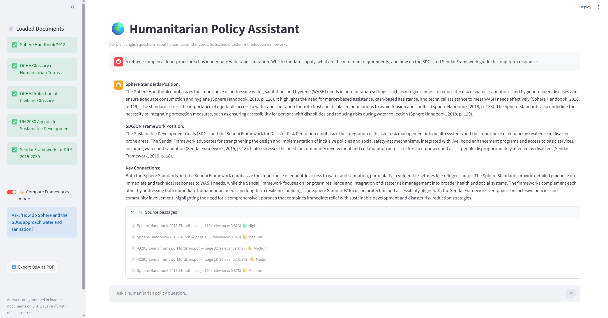
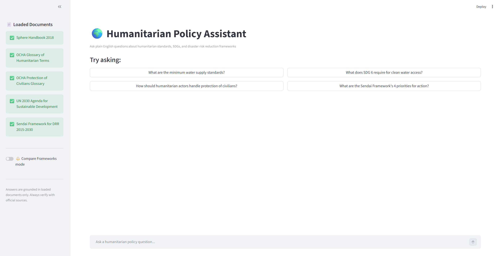

# 🌍 Humanitarian Policy Assistant — RAG System

A Retrieval-Augmented Generation (RAG) system that answers complex humanitarian policy questions in seconds, with citations — built on 5 major UN and humanitarian frameworks.

---

## Screenshots

**Compare Frameworks Mode — Cross-framework analysis**


**Main Interface — Sample questions**


---

## What It Does

Instead of manually searching through hundreds of pages of humanitarian guidelines, type a plain English question and get an instant, cited answer — with the exact document and page number referenced.

**Example question:**
> "A refugee camp in a flood-prone area has inadequate water and sanitation. Which standards apply, what are the minimum requirements, and how do the SDGs and Sendai Framework guide the long-term response?"

The system retrieves relevant passages from all 5 frameworks simultaneously and returns a structured, cited answer in under 10 seconds.

---

## Why RAG for Humanitarian Work?

Unlike standard AI tools, a RAG system retrieves answers directly from **your documents** — on your infrastructure, under your control. No data leaves your environment. Every answer is traceable to a specific source.

For UN agencies, NGOs, and humanitarian bodies — where documents are sensitive, frequently updated, and operationally critical — this matters enormously. The same architecture can run on:

- Internal cluster coordination SOPs
- Country-specific humanitarian response plans
- Donor reports and funding guidelines
- Protection frameworks and incident logs

All without exposing sensitive data to external systems.

---

## Knowledge Base

| Document | Source |
|---|---|
| Sphere Handbook 2018 | [spherestandards.org](https://spherestandards.org) |
| OCHA Glossary of Humanitarian Terms | [reliefweb.int](https://reliefweb.int) |
| OCHA Protection of Civilians Glossary | [reliefweb.int](https://reliefweb.int) |
| UN 2030 Agenda for Sustainable Development (SDGs) | [sdgs.un.org](https://sdgs.un.org) |
| Sendai Framework for Disaster Risk Reduction 2015–2030 | [undrr.org](https://undrr.org) |

> **620 pages — 978 chunks — embedded and indexed**

---

## Features

- 🟢🟡🔴 **Confidence indicators** on every retrieved passage
- 🧠 **Conversation memory** — follow-up questions understand context
- ⚖️ **Framework comparison mode** — compare Sphere vs SDGs vs Sendai
- 📄 **Export to PDF** — download the full Q&A session as a report
- 📎 **Source passages** — see the exact text retrieved from each document

---

## Tech Stack

| Component | Tool |
|---|---|
| Document ingestion | LlamaIndex + pdfplumber |
| Vector database | FAISS |
| Embeddings | OpenAI text-embedding-3-small |
| Answer generation | GPT-4o |
| Web interface | Streamlit |
| Environment | Python 3.13 + venv |

---

## Project Structure

```
humanitarian-rag/
├── data/                          # PDF documents (download separately)
├── index/                         # FAISS vector index (generated by ingest.py)
├── venv/                          # Virtual environment (created locally)
├── screenshots/                   # App screenshots
├── config.py                      # Shared settings — models, paths, chunk sizes
├── ingest.py                      # Loads PDFs, creates embeddings, saves FAISS index
├── query_engine.py                # RAG retrieval + GPT-4o answer generation
├── interface.py                   # Streamlit web interface
├── run.bat                        # Windows launcher — double-click to start
└── .env                           # API keys (not included — create your own)
```

---

## Setup

### 1. Clone the repository
```bash
git clone https://github.com/yourusername/humanitarian-rag.git
cd humanitarian-rag
```

### 2. Create and activate virtual environment
```bash
python -m venv venv --without-pip
venv\Scripts\activate
python -m ensurepip --upgrade
```

### 3. Install dependencies
```bash
pip install llama-index llama-index-vector-stores-faiss llama-index-embeddings-openai llama-index-llms-openai faiss-cpu pdfplumber streamlit python-dotenv fpdf2
```

### 4. Download the PDFs
Download the 5 documents listed in the Knowledge Base section above and save them into the `data/` folder.

### 5. Create your `.env` file
```
OPENAI_API_KEY=your-openai-key-here
```

### 6. Build the index
```bash
python ingest.py
```
This runs once and takes 3–5 minutes. The index is saved to disk — no need to run again unless you add new documents.

### 7. Launch the app
```bash
streamlit run interface.py
```
Or double-click `run.bat` on Windows.

---

## Sample Questions

**Single framework:**
- "What is the minimum water supply per person per day according to Sphere?"
- "What are the Sendai Framework's 4 priorities for action?"
- "How does the OCHA glossary define a humanitarian emergency?"

**Cross-framework (use Compare mode):**
- "How do Sphere and the SDGs both address food security?"
- "How do Sphere minimum standards for water connect to SDG 6, and what does Sendai say about protecting these services during disasters?"
- "What do all frameworks say about community participation and local engagement?"

---

## Notes

- Public documents were used for portfolio purposes — the same architecture works on any private document set
- The FAISS index and `venv/` folder are not included in the repository — generate them locally using the setup steps above
- Never commit your `.env` file

---

## Author

Built by **Lana Al Maradni**
Data Analyst | Humanitarian Operations | AI-Augmented Analytics
Dubai, UAE
[LinkedIn](https://www.linkedin.com/in/lana-al-maradni)

*The intersection of AI and humanitarian operations is one of the most underexplored spaces in tech — and I'm just getting started.*

---

*Built with Python, LlamaIndex, OpenAI, FAISS, and Streamlit*
